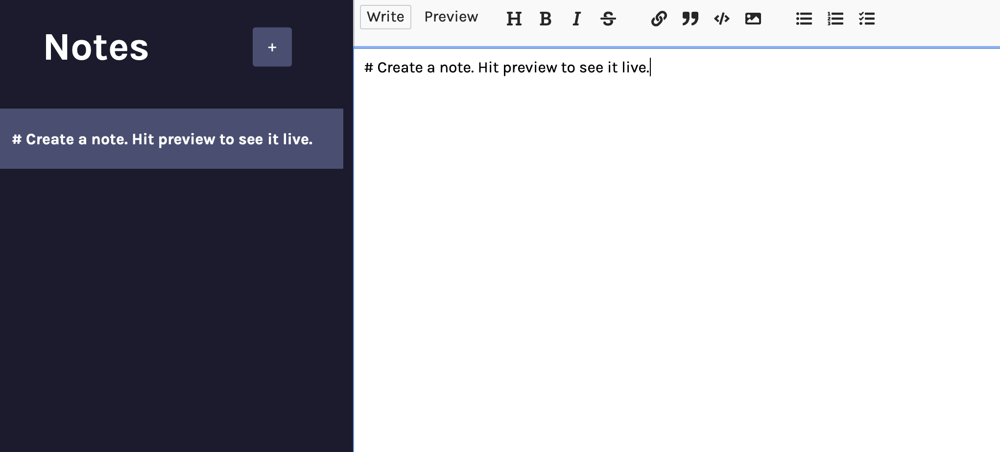

# MyNotes App



MyNotes is a simple and intuitive notes app built with React.js. It allows users to create, edit, and delete notes, providing a convenient way to keep track of important information.

## Features

- **Create Notes**: Users can easily create new notes by entering a title and content.
- **Edit Notes**: Existing notes can be edited by clicking on the note and making changes.
- **Delete Notes**: Users can remove unwanted notes with a simple delete button.
- **Debouncing**: The app implements debouncing to optimize the performance of saving note changes.
- **Asynchronous Functionality**: Asynchronous functions are used to handle interactions with the Firestore database.
- **State Management**: React's state management is utilized to maintain and update the app's data in real time.

## Technologies Used

- **React.js**: A JavaScript library for building user interfaces.
- **CSS**: Cascading Style Sheets for styling the user interface.
- **JavaScript**: The programming language used for app functionality and interactivity.
- **Firestore**: A NoSQL database provided by Firebase, used to store and retrieve notes data.

## Installation

To use MyNotes app locally, follow these steps:

1. Clone the repository:

   ```
   git clone https://github.com/your-username/mynotes-app.git
   ```

2. Navigate to the project directory:

   ```
   cd mynotes-app
   ```

3. Install the dependencies:

   ```
   npm install
   ```

4. Create a Firestore database:

   - Go to the Firebase console: [https://console.firebase.google.com/](https://console.firebase.google.com/)
   - Create a new project (if you haven't already).
   - Enable Firestore for the project.
   - Add the Firestore credentials to your app by creating a `.js` file in the root directory. You'll copy and paste the credentials they give you in your code.

5. Start the development server:

   ```
   npm start
   ```

6. Open your browser and visit http://localhost:5173 to access the MyNotes app or whatever your local browser happens to be.

## Usage

- **Creating a Note**: To create a new note, click on the "New Note" button, enter a title and content in the respective fields, and it will save automatically.

- **Editing a Note**: To edit an existing note, click on the note in the list, make the desired changes and it'll save automatically.

- **Deleting a Note**: To delete a note, click the delete button (trash icon) next to the note in the list.

## Contributing

As this project is intended for learning purposes, contributions are not necessary. However, feel free to fork the repository and customize the app according to your needs.

## License

This project is licensed under the MIT License. You can find more details in the [LICENSE](LICENSE) file.

## Acknowledgments

This app was created as part of a code along on Scrimba to learn React.js. Special thanks to Scrimba and the instructor for providing the educational content.
